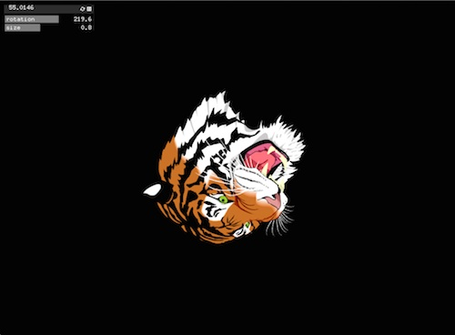
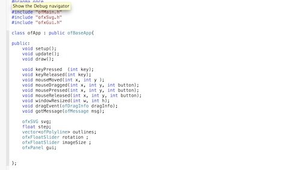
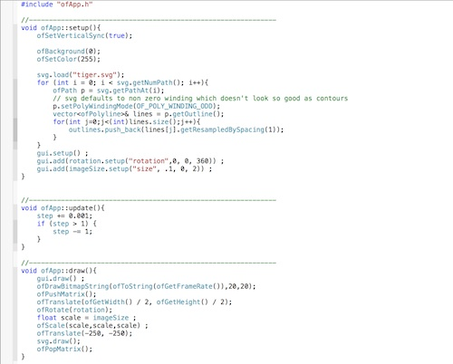

##Svg_gui Mash-up
Alex Esposito 4/7/2015

This code is designed to further solitify the understanding of addons in Open Frameworks. Using both the SVG example and the GUI example the code combines some aspects of both in order to add a gui to the svg example.

The code itself is rather simple in that it simply takes out the mouse movement and presses in the svg example code and replacing it with gui float sliders.

After initializing the sliders and the panel in app.h it is rather simple coding through gui.setup and gui.add in order to add in the gui controls in to setup and then giving the movements in draw the proper variable in order to have the sliders control it.
